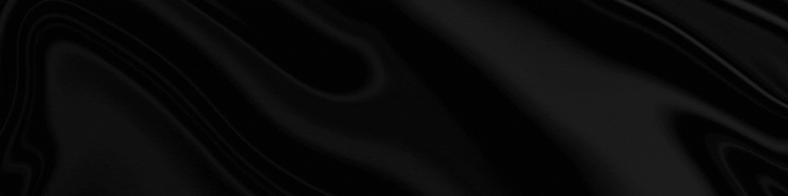

  

# Hi, I'm Md Shale Newaj

**Junior Full Stack Developer | MERN Stack | PERN Stack| Backend-Focused Developer**

I’m a passionate software developer who enjoys building scalable, high-performance web applications that solve real-world problems. I love working with modern JavaScript technologies and continuously improving my skills through hands-on projects.

---

## 🧑‍💻 About Me
- 🔭 Currently working on **full-stack web applications**
- 🌱 Learning advanced **backend architecture & system design**
- 💡 Interested in **API development, databases, and performance optimization**

---

## 🛠️ Tech Stack
### 💻 Frontend
- React.js  
- Next.js  
- HTML5, CSS3  
- Tailwind
- shadcn
- JavaScript
- Typescript

### ⚙️ Backend
- Node.js  
- Express.js  
- RESTful APIs  
- Authentication (JWT, OAuth, Better Auth)
- Prisma ORM

### 🗄️ Database
- MongoDB  
- PostgreSQL  

### 🧰 Tools & Platforms
- Git & GitHub  
- Vercel  
- Firebase  
- Postman 

---

## 📫 Contact Me
- 📧 Email: **newaj.gra@gmail.com**
- 💼 LinkedIn: https://www.linkedin.com/in/muhammad-newaj
- 🌐 Portfolio: https://newaj.vercel.app

---

## ⚡ Fun Fact

> I believe **clean code + clear logic** can solve almost any problem 🚀

---

⭐ *If you like my work, consider starring my repositories!*

