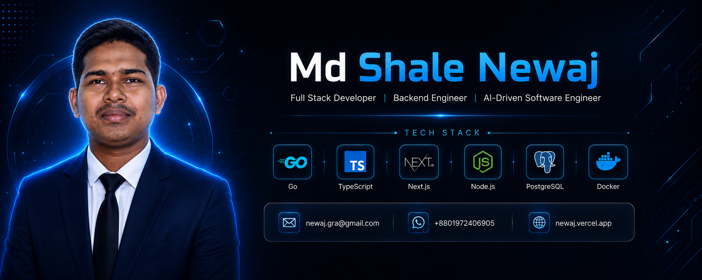

  

  <ul align="center">
  
<h1 style="display: inline-block">Hi 👋, I'm Md Shale Newaj</h1>

  
</ul>

 

<!--- about --->

* 👋 Hi, I’m **[@Newajdev](https://newaj.vercel.app)**
* 🚀 Full Stack Developer passionate about building **SaaS platforms, AI automation systems, and scalable web applications**.
* 🖥️ Frontend expertise in **Next.js, React.js, TypeScript, JavaScript, Tailwind CSS, Zustand, and Framer Motion**.
* ⚙️ Backend development with **Node.js, Express.js, PostgreSQL, Prisma ORM, MongoDB, Mongoose, and REST APIs**.
* 🤖 Building **AI-powered applications, intelligent workflows, chatbot systems, and business automation solutions**.
* 🐳 Working with **Docker, Git, GitHub, Vercel, Railway, and modern deployment workflows**.
* 🌱 Currently exploring **Go (Golang), Microservices Architecture, Advanced System Design, and AI Engineering**.
* 💬 Ask me about **Full-Stack Development, Next.js, Node.js, PostgreSQL, Prisma, SaaS Development, and AI Automation**.
* 🌐 Explore my projects on **GitHub**.
* 📝 I regularly share insights about **Software Engineering, SaaS Development, AI Automation, and Web Technologies**.
* 📫 Reach me at **[Email](mailto:newaj.gra@gmail.com)**

 

<!--- socials --->
## <b> FOLLOW ME ON SOCIALS:</b>

  

    
    
    
    
  

 

---

##  <b> TECHNOLOGY STACK:</b>

---

## 🛠️ Tech Stack
### 💻 Frontend
- React.js  
- Next.js  
- HTML5, CSS3  
- Tailwind
- shadcn
- JavaScript
- Typescript

### ⚙️ Backend
- Node.js  
- Express.js  
- RESTful APIs  
- Authentication (JWT, OAuth, Better Auth)
- Prisma ORM

### 🗄️ Database
- MongoDB  
- PostgreSQL  

### 🧰 Tools & Platforms
- Git & GitHub  
- Vercel  
- Firebase  
- Postman 

---

## 📫 Contact Me
- 📧 Email: **newaj.gra@gmail.com**
- 💼 LinkedIn: https://www.linkedin.com/in/muhammad-newaj
- 🌐 Portfolio: https://newaj.vercel.app

---

## ⚡ Fun Fact

> I believe **clean code + clear logic** can solve almost any problem 🚀

---

⭐ *If you like my work, consider starring my repositories!*

