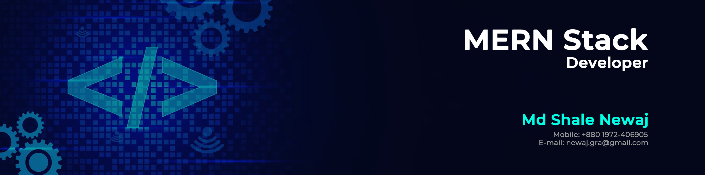

# 💫 About Me:

Hi there 👋   I'm Newaj, a passionate Junior MERN Stack Developer who loves building responsive, dynamic, and user-friendly web applications. I specialize in turning Figma designs into fully functional apps using MongoDB, Express.js, React.js, and Node.js.     💻 Tech Stack   - 💡 Front-End: HTML, CSS, JavaScript, React.js   - âš™ï¸ Back-End: Node.js, Express.js   - ğŸ›¢ï¸ Database: MongoDB   - 🨠Design to Code: Figma to React   - 🔧 Tools: Git, GitHub, VS Code, Postman, Netlify, Vercel   📚 Currently Learning   - TypeScript   - Next.js   - React Native for Mobile Apps - Advanced React Patterns    

## 🌐 Socials:
   

